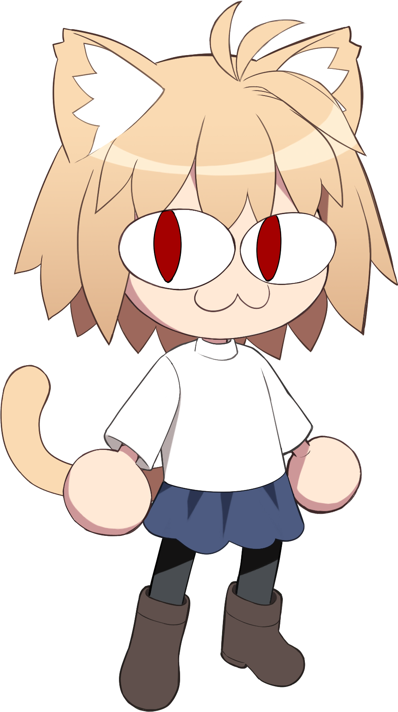

# NecoBot

  

## Overview

NecoBot is a multifunctional Discord bot built to bring life to your community. It combines fun, automation, and clean design into one lightweight and scalable package.

## Features

- Slash commands for games, trading, and interaction
- Automated daily events using scheduled tasks
- Reaction-based logic and polls
- Image recognition and trivia challenges
- Modular structure for easy expansion

## Philosophy

Clean, scalable, and community-oriented. Designed with maintainability in mind using a modern TypeScript codebase and containerized with Docker.

## Built With

- TypeScript
- Node.js
- Docker
- npm
- Node-Cron
- Discord.js
- Various other packages

## Getting Involved

Have ideas? Found a bug? Contributions and suggestions are welcome.

## License

MIT License

          ╱|、
         (˚ˎ 。7
          |、˜〵
          じしˍ,)ノ     BURUNYAAAAA~!
